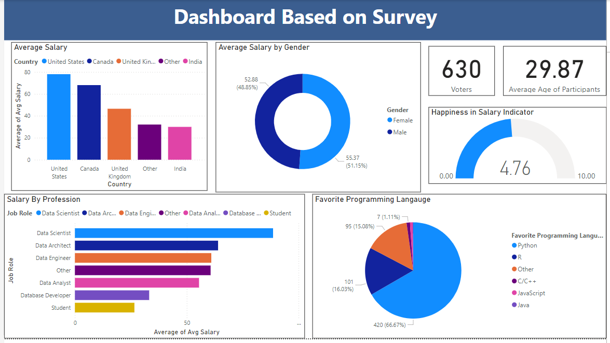

# Power BI Survey Analysis Dashboard

## Project Overview
This project aims to analyze survey data collected from 600+ responses. The survey gathered insights on various aspects such as job titles, salaries, salary expectations, and satisfaction with current salaries. Using Power BI, the data was cleaned, analyzed, and visualized in an interactive dashboard.

## Steps Taken:

### 1. Data Import:
- The dataset was imported into Power BI from an excel file containing survey responses.

### 2. Data Cleaning:
- Missing values were handled by filling or removing where necessary.
- Data types were corrected to ensure proper analysis (e.g., numerical values for salary).
- Unnecessary columns were removed to simplify the dataset.
- Salary ranges were created to categorize salary values into groups.
- Text data like job titles were standardized to avoid inconsistencies (e.g., "Engineer" vs. "engineer").

### 3. Data Analysis:
- Various relationships between job titles, salary satisfaction, and expectations were explored.
- Summary statistics like the average salary per job title and country, and percentage of respondents satisfied with their salary were calculated.

### 5. Dashboard Creation:
- An interactive dashboard was created to visualize the following:
  - **Job Title vs. Average Salary**: A bar chart showing average salaries for different job titles.
  - **Happiness**: A gauge showing happiness/satisfaction amongst the respondents
  - **Favorite Programming Language**: A pie chart visualizing programming languages preferred.
  - **Salary Range Distribution**: A bar chart showing salaries by country.
    
### 6. Insights and Findings:
## Insights:
- **Job Title vs. Average Salary**: Roles like data scientists tend to have higher average salaries compared to other roles.
- **Happiness**: A significant portion of respondents reported lack in satisfaction with their salary.
- **Favorite Programming Language**: Python is the most preferred programming language among respondents.
- **Salary Range Distribution**: Salaries are higher in North America and Western Europe, with lower salaries reported in South Asia and Eastern Europe.
  

## Conclusion
The Power BI dashboard effectively visualized the survey data and provided valuable insights into salary expectations, satisfaction, and trends across various job titles. This dashboard can be used by HR teams or organizations to understand employee expectations and satisfaction with their compensation.

## How to Use:
1. Clone or download the repository.
2. Open the Power BI file in Power BI Desktop.
3. Review the interactive dashboard and explore different visualizations.
4. Optionally, you can update the dataset if you have additional survey data.

## Requirements:
- Power BI Desktop (latest version recommended).
- Survey dataset in Excel/CSV format.
